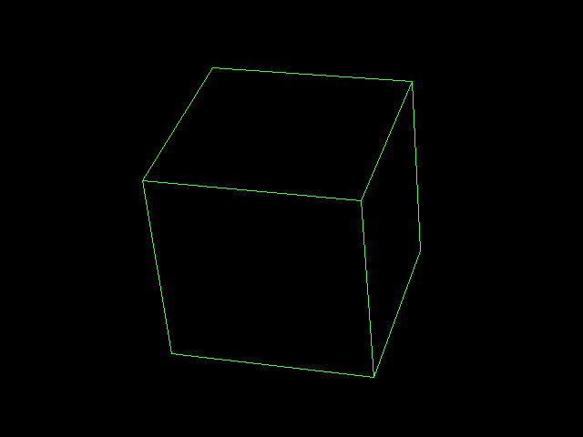
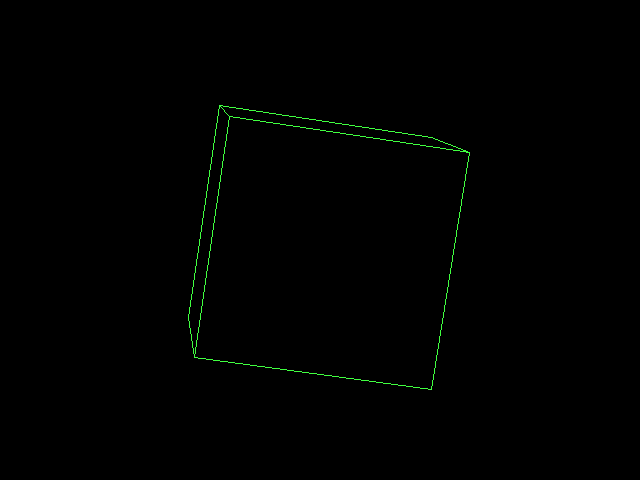

# Sage040 wireframe cube

**A rotating 3D wireframe cube on the Sage040**, computed live in C on a
68040. Every frame does the rotation, projection, hidden-line removal and line
drawing from first principles — nothing is precomputed except the sine table.

A companion to [`c64-wireframe-cube`](../../c64-wireframe-cube), doing the same
job on a machine two decades younger.

> **There are two cubes, and this is the bare-metal one.**
>
> This one *is* the machine: no kernel underneath, supervisor mode, and it
> drives the SM501 and the MFP's timers itself. It exists to **measure** —
> it benchmarks clearing the screen with the CPU against clearing it with
> the 2D engine, and paces itself off a hardware timer. That is a hardware
> test, and it belongs on bare metal.
>
> [`../user/cube.c`](../user/) is the other one: a **program**, loaded off
> the disk by name and run from the shell. It opens `/dev/fb0`, draws with
> ioctls and sleeps on the kernel's tick, and includes no hardware header
> at all. That is the one to read if you want to know how to write
> something for this machine; this is the one to read if you want to know
> what the hardware will do.



640×480, 8 bits per pixel, double buffered in the SM501's video memory,
cleared by the SM501's 2D engine. 5,944 bytes of code.

## Running

```
make          # build cube.elf
make run      # run it in a window, console on stdio
make shot     # run headless and capture docs/cube*.png
```

`make run` opens a window and prints to the terminal:

```
Sage040 wireframe cube
640x480, 8bpp, double buffered in SM501 video memory
8 vertices, 12 edges, backface culled, perspective projected

unthrottled frame rate (see SPEED= in the Makefile):
  clear by CPU stores    38 frames/sec
  clear by 2D engine     430 frames/sec   (113/10 x faster)

pacing to 50 frames/sec

frame 250  fps 50.0
frame 500  fps 50.0
```

The two numbers are measured at start-up, half a second each, by rendering
frames as fast as the machine will go with each clear method.

By default the CPU is throttled to roughly 68040 speed and the figures above
are reproducible run to run. `make run SPEED=off` lets it run at host speed
instead; see below.

It needs the cross toolchain at `~/m68k/install` and the patched QEMU at
`~/m68k/sage040-qemu`. It builds against the support files in
[`../tests/`](../tests) — `crt0.s`, `sage040.ld`, `uart.c` and `mfp.c` — so it
is one C file plus a Makefile.

## What it does, every frame

1. **Clear** the back buffer — one Rectangle Fill command to the SM501's
   2D engine. Set `use_2d = 0` in `cube.c` to do it with CPU stores instead
   and watch the frame rate fall — by about six times at host speed, and by
   eleven at a period-correct 25 MHz. The table below has both.
2. **Rotate the six face normals** through the current `ax`, `ay`, `az` and
   keep the sign of each rotated Z. That is the hidden-line test.
3. **Rotate the eight vertices** `(±64, ±64, ±64)` through the same three
   angles and **project** them with perspective divide.
4. **Draw the visible edges** as Bresenham lines. An edge is drawn only if at
   least one of the two faces it joins points at the viewer, which hides the
   three or four edges round the back.
5. **Flip** the SM501's framebuffer address to the buffer just drawn, so the
   viewer never sees a half-drawn frame.
6. **Wait** for the frame to be due.

Angles are 0–255, so a full turn is 256 steps. The three axes advance at
different rates (+1, +2, +1 per frame) to give a tumble that does not repeat
quickly.

## What the 68040 buys over the 6502

| | C64 | Sage040 |
|---|---|---|
| Multiply | quarter-square table, ~40 cycles | `muls.l`, one instruction |
| Projection | orthographic — division too expensive | **perspective**, `divs.l` |
| Angle steps | 64 | 256 |
| Resolution | 320×200, 1bpp | 640×480, 8bpp |
| Double buffer | two VIC banks, ROM-shadow tricks | two offsets in 16 MiB of video memory |
| Frame rate | 5.1 fps (NTSC) | 38 fps unthrottled at ~25 MHz, paced to 50 |

The C64 version's README lists perspective projection under "ideas not yet
implemented", because dividing by `z + k` needs a division routine the 6502
does not have. The 68040 does, so the cube here has real depth — the near
corner visibly draws larger than the far one.

Everything else is deliberately the same algorithm. The interesting part of
porting it was not the maths, which got easier, but the hardware around it.

## How it works

- **Sine by symmetry.** One quarter-turn of sine in Q12, 65 entries, with the
  full circle reconstructed by reflection. No floating point anywhere, and
  nothing computed at start-up.
- **Hidden-line removal on a convex solid.** Six face-visibility flags come
  from the signs of the faces' rotated Z normals. An edge table lists, for each
  of the twelve edges, the two faces it joins; the edge is drawn if either is
  visible.
- **Double buffering by register write.** Two framebuffers sit 1 MiB apart in
  video memory. Flipping is a single write to the SM501's panel framebuffer
  address register — the display controller starts scanning out the other
  buffer on the next frame.
- **Frame pacing from a hardware timer.** MC68901 timer D runs at /200 with a
  reload of 123, which is 24,600 timer-clock cycles at 2.4576 MHz — 10.0 ms.
  Its interrupt increments a counter, and the main loop waits until the next
  frame is due. Without this the cube completes a full tumble in about
  50 ms, far too fast to watch.
- **Perspective, and its sign.** `+Z points at the viewer`, which is the
  convention backface culling already uses — a face is visible when its
  rotated normal has positive Z. So a vertex with larger Z is *nearer*, and
  its distance from the camera is `DIST - z`. Getting that backwards inverts
  the perspective: far corners draw larger than near ones, which does not
  look obviously broken, it just looks like a badly distorted cube.
- **How strong the perspective is** is set by `DIST`, as the ratio by which
  the nearest corner draws larger than the farthest — `(DIST + R) / (DIST - R)`
  where `R = sqrt(3) x HALF = 110.9`:

  | `DIST` | ratio | |
  |---|---|---|
  | 350 | 1.93 | severe wide angle, faces collapse to slivers |
  | 700 | 1.38 | |
  | **1000** | **1.25** | natural — what is used here |
  | 1600 | 1.15 | nearly orthographic |

  `SCALE` then sets the size: 1800 keeps the cube about 200 pixels from
  centre at its widest, which fits 640x480 with margin.
- **Clipped plotting.** Every pixel is bounds-checked, so a projection that
  swings a vertex off screen cannot corrupt memory. At these angles nothing
  ever does, but the cube is meant to be edited.
- **The clear is done by the display controller.** Filling 307,200 bytes was
  by far the most expensive thing in a frame — eight vertices and nine short
  lines are nothing beside it. The SM501's 2D engine does it as a single
  Rectangle Fill: seven register writes, and the CPU never touches the
  framebuffer. Measured at **5.9x** the whole-frame rate at host speed, and
  **11.3x** at the 25 MHz the Makefile actually defaults to — the slower
  the CPU, the more the blitter is worth.

## Running it at period speed

`make run` throttles the CPU with QEMU's `-icount` so the machine executes a
fixed number of instructions per second instead of going as fast as the host
allows. The default, `SPEED=6`, is 15.6 M instructions/sec — in the region of a
**25 MHz 68040**, the speed the part launched at in 1990 and the one in a
Quadra 700 or an Amiga 4000/040.

```
make run SPEED=5     # 31.2 M instr/sec, faster than any 68040 shipped
make run SPEED=6     # 15.6 M instr/sec, about a 25 MHz 68040  (default)
make run SPEED=7     #  7.8 M instr/sec, about a 68020
make run SPEED=off   # host speed, non-deterministic
```

This changes the answer, and it is the honest version of it:

| | CPU clear | 2D engine clear |
|---|---|---|
| Host speed | 2444 fps | 14520 fps (5.9x) |
| ~25 MHz 68040 | **38 fps** | **430 fps (11.3x)** |
| Paced to 50 fps | **37.2 fps — misses** | **50.0 fps — holds** |

At period speed the CPU clear **cannot sustain the 50 fps target** while the 2D
engine holds it exactly with an order of magnitude to spare. That is a far more
useful statement about the 2D engine than any ratio measured on a modern host.

What `-icount` does and does not model is in
[`../programmer-guide.md`](../programmer-guide.md) — briefly, it charges every
instruction the same time and models no cache or memory latency, so treat it as
a reproducible order-of-magnitude model rather than cycle accuracy.

The paced 50 fps figure is exact regardless, because it is the MFP timer doing
the pacing.

## Fixed point or the FPU

The cube is written in Q12 fixed point and by default never touches the
68040's floating-point unit — the whole binary contains **zero** FP
instructions. Building with `-DUSE_FLOAT=1` switches the rotation and the
perspective divide to the on-chip FPU instead, leaving everything else
alone.

```
make run-float    # the FPU variant
make compare      # run both and print the table below
```

Measured under `-icount shift=6`, so virtual time is deterministic and
proportional to instruction count:

| | fixed point | 68040 FPU |
|---|---|---|
| frames/sec (2D clear) | 470 | **486** |
| instructions per frame | 33,244 | **32,150** |
| FP instructions in binary | 0 | 71 |
| ELF size | 16,208 | 16,464 |
| mean projection error vs exact maths | 2.18 px | **0.78 px** |

Two real results, and one thing this does **not** show.

**The FPU version is about 3x more accurate.** Fixed point loses precision to
six arithmetic right shifts per vertex, and `asr` truncates toward negative
infinity, so the error is not only larger but systematically biased. Against
exact trigonometry the fixed-point projection is out by 2.18 pixels on
average; the FPU version by 0.78.

**It also executes slightly fewer instructions** — about 3% — because a
rotation term is one `fsmul` rather than a `mulsl` plus an `asrl`.

**But fewer instructions is not less time, and this cannot tell you which is
faster.** `-icount` charges every instruction the same 2^N nanoseconds, so an
`fsmul.s` is priced identically to a `nop`. On real silicon it is not: 68040
FP operations take several cycles, and each float-to-int conversion brackets
itself with `fmovem.l %fpcr` to set and restore the rounding mode, which the
integer path does not pay at all. On real hardware fixed point would very
likely still win on time despite running more instructions — but quantifying
that needs the 68040 timing tables, not this emulator.

So: keep the fixed-point version as the default, because it is the period-
correct choice and it runs unchanged on a 68EC040 or 68LC040 with no FPU at
all. The float variant is here because the FPU is real hardware on this
machine and it deserved to be exercised with real work rather than only by a
bit-pattern test.



## Files

| File | |
|---|---|
| `cube.c` | the whole program, both arithmetic variants |
| `Makefile` | build, run, screenshot, compare |
| `shot.sh` | drives QEMU's monitor socket to capture frames |
| `compare.sh` | runs both variants and prints the comparison table |
| `docs/cube*.png` | captured frames |

## The 2D engine clear

The SM501's drawing engine lives at `0xff500000`, is little-endian and
32-bit-only like the rest of its registers, and starts an operation when
bit 31 of the control register is written:

```c
SM501_WR(SM501_2D_DST_BASE, back);                      /* target buffer  */
SM501_WR(SM501_2D_DEST, 0);                             /* x = y = 0      */
SM501_WR(SM501_2D_DIMENSION, (640 << 16) | 480);
SM501_WR(SM501_2D_PITCH, (640 << 16) | 640);
SM501_WR(SM501_2D_FOREGROUND, 0);
SM501_WR(SM501_2D_STRETCH, SM501_2D_FMT_8BPP);          /* XY addressing  */
SM501_WR(SM501_2D_CONTROL, SM501_2D_START | SM501_2D_CMD_RECTFILL);
```

Seven writes replace 76,800. Output is pixel-for-pixel identical to the CPU
clear — verified by comparing captured frames from both paths, and again in
the live window.

One thing worth knowing if you build on this: QEMU's SM501 model only marks
the framebuffer dirty after a 2D operation if the destination is the buffer
**currently being displayed**, which is never true when double buffering.
That looked like it should cause stale pixels. It does not — a scene drawn
entirely by the 2D engine, with no CPU writes to video memory at all,
renders cleanly with no trailing. Tested rather than assumed.

## Ideas not yet implemented

- **Filled faces** with a painter's algorithm — the face visibility flags and
  depth ordering are already computed, and the 2D engine can fill the
  triangles.
- **A second solid**, to make the hidden-line problem non-convex and force a
  real depth test.
- **Lines in the 2D engine too.** The engine has a BitBlt; the edges are still
  drawn pixel by pixel by the CPU. They are cheap now, but they are what is
  left.
- **Shaded edges** using more of the 8-bit palette, for depth cueing.
