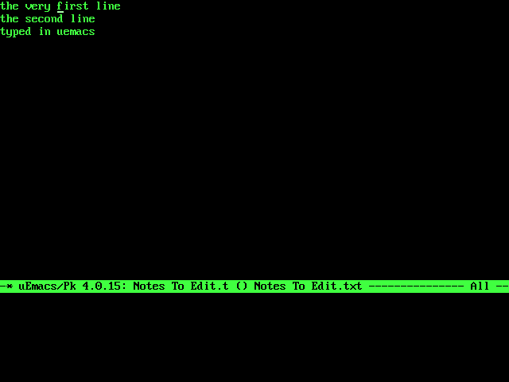

# uEmacs/PK on Sage040



Linus Torvalds' [uEmacs/PK](https://github.com/torvalds/uemacs), a
MicroEMACS 3.9e descendant, built against picolibc and running as
`/bin/em` -- the first program on this machine written by somebody else.

```bash
make libc                  # once: picolibc and termcap
make -C ports/uemacs       # fetch, patch, build ./em
make -C ports/uemacs install
```

and on the machine, `em FILE`. The usual keys: C-x C-s saves, C-x C-c
quits, C-x C-f finds a file, C-s searches.

## The source is not here

uEmacs's licence is MicroEMACS 3.9's -- free to copy and modify, not for
commercial use -- and not the GPL, so its source is never copied into
this tree. `build.sh` clones it at a fixed commit into `~/m68k/src` and
applies `patches/sage040.patch`, which says what it changes and why:
termcap from `<termcap.h>` rather than ncurses, an `itoa` renamed away
from picolibc's, and Linux-only terminal flags cleared only where they
exist.

## What it needed from the system

Everything it uses is ordinary POSIX, and most of it was already there.
What porting it added:

- **termcap** (`libc/termcap/`): uEmacs draws through termcap. There is
  no database here, because there is one terminal: a VT102, which the
  screen emulates and anything on the serial line can be. The library
  has that one compiled in, and asks the terminal for its size.
- **`flock`**, in the kernel and in picolibc: uEmacs locks the file it
  is editing, so a second editor on the same file is told.
- **A writer while a reader has the file open.** uEmacs keeps the file
  open, to hold that lock, and then saves over it. The FAT driver kept
  a file's size and chain in each open handle, so it refused a writer
  while any reader had it; they are shared now (`struct fat_node`), as
  an inode is on Linux.
- **`struct winsize` from `<sys/ioctl.h>`, and `FIONREAD`**, which
  picolibc did not provide (`libc/patches/`).

## How it is tested

`kernel/uemacstest.sh` edits a file the host put on the disk, entirely
with keystrokes down the serial line -- M-> to the end and a line typed,
M-< to the top and a word inserted mid-line, C-x C-s, C-x C-c -- then
reads the file back with mtools. While the editor is up, `vcsnap` copies
`/dev/vcsa` to a file, and the host checks the screen had the text and a
reverse-video mode line naming the file. Afterwards the terminal's modes
must be back as they were. The picture above is that session's screen.
