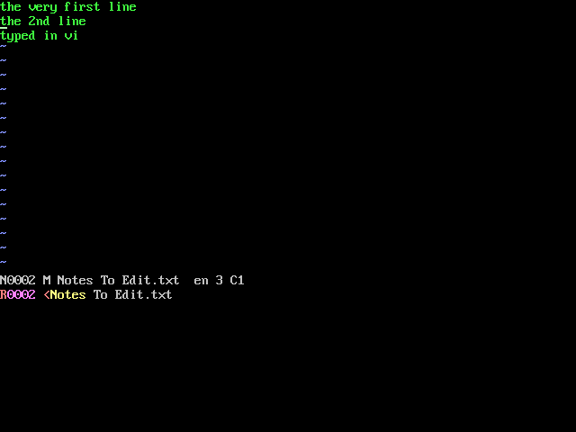

# vi on Sage040: neatvi



[neatvi](https://github.com/aligrudi/neatvi), Ali Gholami Rudi's small
vi and ex, built against picolibc and running as `/bin/vi`.

```bash
make libc                  # once
make -C ports/vi           # fetch, patch, build ./vi
make -C ports/vi install
```

## Why neatvi

It is a complete vi -- motions, operators, counts, registers, undo,
marks, ex commands with regular expressions, `:!`, multiple windows --
in about 9,000 lines that need nothing but POSIX. It writes its own
escape sequences, so it needs no termcap at all, and its colours come
out as ANSI SGR, which the VT102 console draws.

BusyBox's `vi` was the other candidate, and is what `emacs.md` named.
It lives inside BusyBox's `libbb`, whose header pulls in the network
headers picolibc does not have, so building it would have meant porting
a good part of BusyBox. neatvi is ISC-licensed; it is fetched at a fixed
commit, like uEmacs, rather than copied in.

## What it needed

- **`ftruncate`** (and `truncate`): neatvi truncates a file it rewrites.
  The kernel had neither; FAT now cuts a chain or extends a file with
  zeroes (`fat_file_truncate`), and picolibc gets the wrappers.
- **`<poll.h>` that compiles on its own**: picolibc's used `__size_t`
  without including where it is defined (`libc/patches/`).
- **`patches/sage040.patch`**: its client for a named Unix-domain socket
  is compiled out, since there are none here and picolibc has no
  `<sys/socket.h>`.

## Layout

neatvi uses one row more than the terminal reports: with 24 rows it
puts its status line on row 24 and its message line on 25. On a real
24-row terminal the last line lands on the one above it; on this
machine's 30-row screen both show. That is neatvi's own layout, measured
by setting the size with `stty rows`, not something the system does.

## How it is tested

`kernel/vitest.sh`: `G` `o` and a line typed, `1G` `0` `4l` `i` and a
word inserted, `2G` `dd` `u`, `:%s/second/2nd/`, `:wq` -- then the host
reads the file. `vcsnap` copies the screen mid-session for the host to
check. The picture above is from that session.
